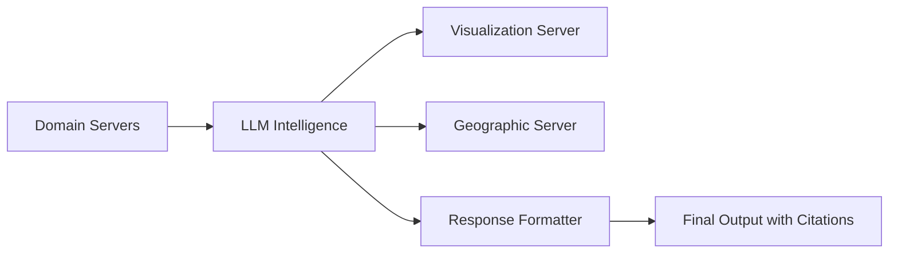

# ODE MCP Generic Framework

A domain-agnostic MCP (Model Context Protocol) API framework with advanced citation system, generic visualization primitives, and universal geographic tools.

## ✨ Features

- **🔥 Battle-tested Infrastructure**: Proven orchestration engine with performance optimizations
- **📚 Advanced Citation System**: Intelligent LLM-based contextual citation placement
- **📊 Generic Visualization**: Chart primitives that work across all domains
- **🗺️ Universal Geographic Tools**: Mapping and spatial analysis capabilities
- **⚡ High Performance**: Singleton MCP client pattern for 5-10x faster responses
- **🔧 Configuration-Driven**: No hard-coded mappings, fully customizable
- **🏗️ Abstract Base Classes**: Consistent patterns with detailed examples
- **🔄 Fork-Friendly**: Easy to customize for any domain

## 🚀 Quick Start

### 1. Clone and Setup

```bash
git clone https://github.com/ode-pbllc/ode-mcp-generic.git
cd ode-mcp-generic

# Create virtual environment
python -m venv venv
source venv/bin/activate  # On Windows: venv\\Scripts\\activate

# Install dependencies
pip install -r requirements.txt
```

### 2. Configure for Your Domain

```bash
# Copy configuration templates
cp config/servers.example.json config/servers.json
cp config/citation_sources.template.json config/citation_sources.json
cp config/featured_queries.template.json config/featured_queries.json

# Set up environment variables
cp .env.example .env
# Edit .env with your API keys
```

### 3. Create Your Domain Server

```bash
# Copy template server as starting point
cp mcp/template_server.py mcp/your_domain_server.py
# Edit your_domain_server.py for your specific domain
```

### 4. Run the API Server

```bash
python api_server.py
```

The API will be available at `http://localhost:8098`

## 🏗️ Architecture

### Core Components

- **`api_server.py`**: FastAPI server with universal endpoints
- **`mcp/mcp_chat.py`**: Core orchestration engine (domain-agnostic)
- **`mcp/response_formatter_server.py`**: Advanced citation system
- **`mcp/visualization_server.py`**: Generic chart primitives
- **`mcp/geographic_server.py`**: Universal mapping tools

### Abstract Base Classes

- **`mcp/base_server.py`**: Template for MCP servers with examples
- **`mcp/base_data_manager.py`**: Data management patterns
- **`mcp/template_server.py`**: Complete reference implementation

### LLM-Orchestrated Flow



## 📊 API Endpoints

### Core Endpoints
- `POST /query` - Process queries with full response
- `POST /query/stream` - Process queries with real-time streaming
- `GET /health` - Health check and status
- `GET /featured-queries` - Domain-specific example queries
- `GET /config/info` - Configuration information

### Example Request
```bash
curl -X POST http://localhost:8098/query \\
  -H "Content-Type: application/json" \\
  -d '{"query": "Show me trends in renewable energy adoption", "include_thinking": false}'
```

## 🔧 Configuration

### Server Configuration (`config/servers.json`)
```json
{
  "servers": [
    {
      "name": "your_domain_data",
      "path": "mcp/your_domain_server.py",
      "description": "Main domain data server"
    },
    {
      "name": "visualization",
      "path": "mcp/visualization_server.py",
      "description": "Generic visualization server"
    }
  ]
}
```

### Citation Sources (`config/citation_sources.json`)
```json
{
  "tool_citations": {
    "YourDomainTool": {
      "source_name": "Your Data Source Name",
      "provider": "Your Organization",
      "spatial_coverage": "Geographic coverage",
      "temporal_coverage": "Time period",
      "source_url": "https://yourdatasource.com"
    }
  }
}
```

## 💻 Creating Your Domain Server

### 1. Extend Base Classes

```python
from base_server import BaseMCPServer
from base_data_manager import BaseDataManager

class YourDataManager(BaseDataManager):
    def load_data(self) -> bool:
        # Load your domain data
        self.data = pd.read_csv("your_data.csv")
        return True
    
    def search(self, query: str, filters: Dict = None) -> List[Dict]:
        # Implement domain-specific search
        return results
    
    def get_statistics(self) -> Dict[str, Any]:
        # Return dataset statistics
        return stats

class YourDomainServer(BaseMCPServer):
    def __init__(self):
        super().__init__("your-domain-server")
        self.data_manager = YourDataManager("data/your_domain/")
    
    def get_metadata(self) -> Dict[str, str]:
        return {
            "Name": "Your Domain Server",
            "Description": "Provides your domain-specific data and analysis",
            "Version": "1.0.0",
            "Author": "Your Organization"
        }
    
    def setup_tools(self):
        @self.mcp.tool()
        def YourDomainTool(param: str) -> Dict[str, Any]:
            # Your tool implementation
            return {"result": "your data"}
    
    def get_citation_info(self, tool_name: str, tool_args: Dict = None) -> Dict:
        # Map tools to citation information
        return citation_mapping.get(tool_name, self._default_citation())
```

### 2. Update Configuration

Add your server to `config/servers.json` and citation mappings to `config/citation_sources.json`.

### 3. Test Your Implementation

```python
# Test your server
if __name__ == "__main__":
    server = YourDomainServer()
    server.run()
```

## 🧪 Testing

### Run Test Scripts

```bash
# Test citation system
python test_scripts/test_citation_system.py

# Test server connectivity
python test_scripts/test_server_connectivity.py

# Test API endpoints
python test_scripts/test_api_endpoints.py
```

### Manual Testing

```bash
# Health check
curl http://localhost:8098/health

# Test query
curl -X POST http://localhost:8098/query \\
  -H "Content-Type: application/json" \\
  -d '{"query": "test query"}'
```

## 📈 Available Chart Types

The visualization server provides generic chart primitives:

- **Line Charts**: `CreateLineChart(x_data, y_data, ...)`
- **Bar Charts**: `CreateBarChart(categories, values, ...)`
- **Pie Charts**: `CreatePieChart(labels, values, ...)`
- **Scatter Plots**: `CreateScatterPlot(x_data, y_data, ...)`
- **Histograms**: `CreateHistogram(data, bins, ...)`
- **Time Series**: `CreateTimeSeriesChart(dates, values, ...)`
- **Heatmaps**: `CreateHeatmap(data, x_labels, y_labels, ...)`
- **Tables**: `CreateTableVisualization(data, ...)`

## 🗺️ Geographic Capabilities

Universal mapping and spatial analysis tools:

- **Point Maps**: `CreatePointMap(locations, ...)`
- **Choropleth Maps**: `CreateChoroplethMap(regions_data, ...)`
- **Geocoding**: `GeocodeLocations(addresses, ...)`
- **Distance Calculation**: `CalculateDistance(point1, point2, ...)`
- **Radius Search**: `FindPointsInRadius(center, points, radius, ...)`
- **Bounding Boxes**: `CreateBoundingBox(points, ...)`

## 🔄 Fork-Based Development

**👥 New to fork-based workflows?** See our comprehensive [Fork Workflow Guide](FORK_WORKFLOW.md) with step-by-step instructions and troubleshooting.

### Quick Start for New Domains

1. **Fork this repository** with a descriptive name (`your-domain-api`)
2. **Add your domain servers** in `mcp/`
3. **Add your data** in `data/`
4. **Configure** `config/*.json` files
5. **Test and deploy**

### Staying Updated with Framework Improvements

```bash
# Set up upstream remote (one time)
git remote add upstream https://github.com/ode-pbllc/ode-mcp-generic.git

# Weekly: sync with framework improvements
git fetch upstream
git merge upstream/main
```

**Key Benefits:**
- Your domain-specific code remains separate
- Automatic access to framework improvements and bug fixes
- Can contribute generic improvements back to help everyone
- Team shares the same high-quality infrastructure patterns

📖 **[Read the complete Fork Workflow Guide →](FORK_WORKFLOW.md)**

## 📚 Documentation

- **[Setup Guide](docs/SETUP.md)**: Detailed setup instructions
- **[MCP Development](docs/MCP_DEVELOPMENT.md)**: Creating custom servers
- **[API Integration](docs/API_INTEGRATION.md)**: Using the API endpoints
- **[Deployment Guide](docs/DEPLOYMENT.md)**: Production deployment

## 🏢 Example Domains

### Finance Example
```bash
# Explore the complete finance example
cd examples/finance_example/
```

See `examples/finance_example/` for a complete implementation showing:
- Financial data server
- Stock price tools  
- Market analysis capabilities
- Proper citation mapping

## 🤝 Contributing

We welcome contributions! Please see our [Contributing Guide](CONTRIBUTING.md) for details.

### Areas for Contribution
- Additional chart types in visualization server
- More geographic analysis tools  
- Domain-specific server examples
- Documentation improvements
- Performance optimizations

## 📄 License

MIT License - see [LICENSE](LICENSE) file for details.

## 🆘 Support

- **Issues**: [GitHub Issues](https://github.com/ode-pbllc/ode-mcp-generic/issues)
- **Discussions**: [GitHub Discussions](https://github.com/ode-pbllc/ode-mcp-generic/discussions)
- **Documentation**: [Wiki](https://github.com/ode-pbllc/ode-mcp-generic/wiki)

## 🌟 Powered By

- **FastMCP**: Model Context Protocol implementation
- **FastAPI**: High-performance API framework
- **Plotly**: Interactive visualizations
- **GeoPandas**: Geographic data processing
- **Anthropic**: LLM orchestration and citation intelligence

---

**Built with ❤️ by [ODE PLLC](https://github.com/ode-pbllc)**

Transform any domain into a powerful MCP API with advanced citation system and visualization capabilities.