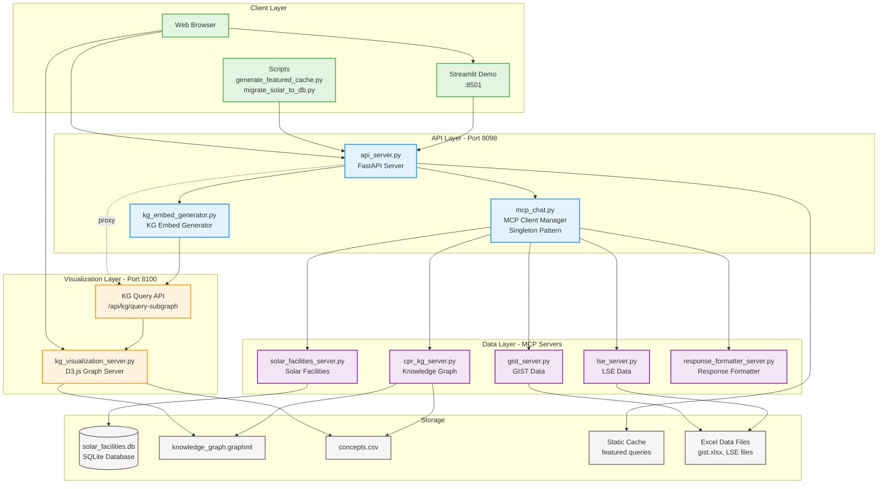

# TDE System Architecture

## Overview
The TDE (Transitional Data Exchange) system is a three-tier architecture for querying and visualizing climate policy data.

## Architecture Diagram

## Key Components

### 1. Client Layer
- **Web Browser**: Direct access to API endpoints and KG visualization
- **Streamlit Demo** (port 8501): Interactive web UI for testing all features
- **Scripts**: Utility scripts for cache generation and data migration

### 2. API Layer (Port 8098)
- **api_server.py**: Main FastAPI server handling all API requests
- **mcp_chat.py**: Singleton MCP client manager for efficient connection pooling
- **kg_embed_generator.py**: Generates embeddable KG visualizations

### 3. Visualization Layer (Port 8100)
- **kg_visualization_server.py**: Standalone D3.js graph visualization server
- **KG Query API**: RESTful API for graph queries and subgraph extraction
- Clean iframe-embeddable interface

### 4. Data Layer (MCP Servers)
- **cpr_kg_server.py**: Knowledge graph concepts and relationships
- **solar_facilities_server.py**: Geospatial solar facility data
- **gist_server.py**: GIST climate data
- **lse_server.py**: LSE policy data
- **response_formatter_server.py**: Formats and structures responses

### 5. Storage
- **SQLite Database**: Optimized solar facilities data (30s → <1s queries)
- **GraphML/CSV**: Knowledge graph structure and concepts
- **Static Cache**: Pre-computed featured query responses
- **Excel Files**: Source data for GIST and LSE

## Data Flow

1. **Query Flow**:
   - Client → API Server → MCP Client → MCP Servers → Data Sources
   - Responses flow back through formatters to client

2. **Visualization Flow**:
   - API Server generates KG URLs → Client opens KG Viz Server
   - KG Viz Server queries graph data directly

3. **Caching**:
   - Featured queries are pre-computed and cached
   - Static files served directly for performance

## Key Design Decisions

1. **Separation of Concerns**: Each layer has a specific responsibility
2. **Singleton MCP Client**: Reduces connection overhead (5-10x performance gain)
3. **Separate Visualization Server**: Clean embedding and independent scaling
4. **SQLite Migration**: Massive performance improvement for geospatial queries
5. **Static Caching**: Instant responses for common queries